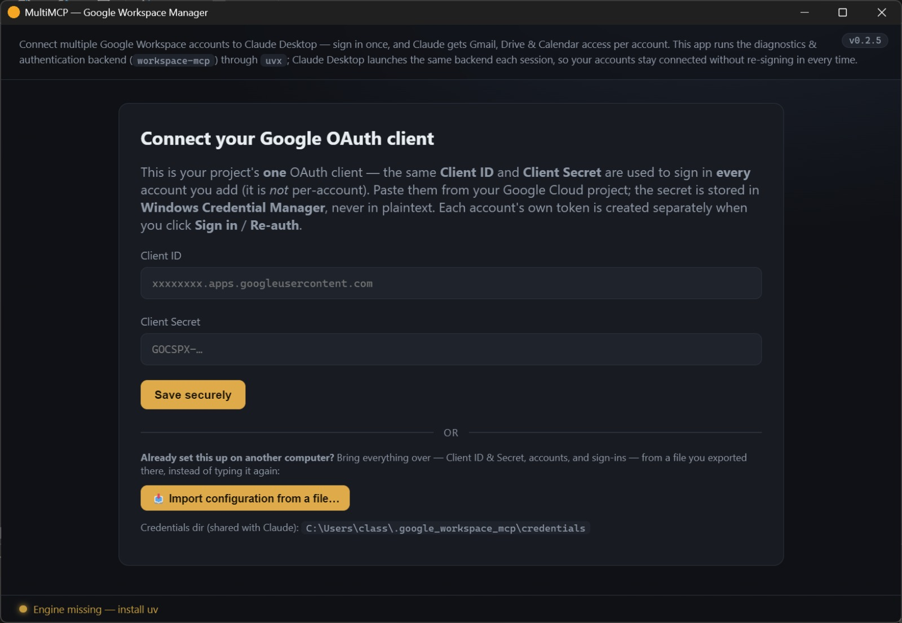

# MultiMCP — Google Workspace Manager

A local Windows desktop control panel that connects **multiple Google Workspace
accounts** to your AI client (Gmail, Drive, Calendar) without hand-editing config
files. **Works with Claude Desktop and OpenAI Codex** — one set of sign-ins serves
both. It wraps the proven [`workspace-mcp`](https://github.com/taylorwilsdon/google_workspace_mcp)
server — this app handles credentials, per-account sign-in, status, and writing the
client config.

## ⬇️ Download & install

**[➤ Download the latest Windows installer](https://github.com/taipeiviking/MultiMCP/releases/latest)**
— then run the **`Google-Workspace-Manager-Setup-<version>.exe`** attached to the newest release.

1. On the Releases page, under **Assets**, click
   **`Google-Workspace-Manager-Setup-<version>.exe`** to download (take the newest release;
   the version number in the filename changes with each one).
2. Run it. If Windows **SmartScreen** shows a one-time *"Windows protected your PC"*
   notice (normal for any app downloaded from the web without a paid code-signing
   certificate), click **More info → Run anyway**. Installs per-user; no admin needed.
3. Launch the app (the **uv engine is bundled — no separate install needed**),
   enter your Google OAuth Client ID + Secret once (or **Import** a config file from
   another computer), add each account and **Sign in**, click **Write config** (and/or
   **Write Codex config**), and restart the AI client.

> **New in v0.5.0 — OpenAI Codex support.** Next to the Claude **Write config** button there
> is now a **Write Codex config** button, which adds the same connector to OpenAI Codex in
> one click. There is nothing to re-authorize: Codex is pointed at the same credentials, so
> it reuses the sign-ins you already made. Details:
> [Connecting to OpenAI Codex](#-connecting-to-openai-codex).

> **New in v0.4.0 — worth knowing if you're upgrading.** The connector now appears in Claude
> as **MultiMCP** (it used to be called `google_workspace`; the app removes the old entry when
> it writes the new one, so you won't end up with two). This release also **fixes the unwanted
> Google sign-in tabs** that opened — one per account, each landing on an "Access blocked" error
> — as soon as a single Claude conversation used more than one account. Install over the top,
> launch the app once, then fully quit and reopen Claude Desktop.

Full step-by-step guide: **[HELP.md](HELP.md)**. Adding more Google accounts (illustrated
walkthrough, incl. getting out of Testing mode): **[docs/ADD_ACCOUNT.md](docs/ADD_ACCOUNT.md)**.
What changed in each version: **[CHANGELOG.md](CHANGELOG.md)**.

## 🔌 Connecting to Claude Desktop

Wiring your Google accounts into **Claude Desktop** is one click from the app — you never
hand-edit Claude's config. (Using **OpenAI Codex** instead, or as well? See
[Connecting to OpenAI Codex](#-connecting-to-openai-codex) below; the two can share the
same sign-ins.)

1. **Finish setup in the app first** — enter your Google OAuth **Client ID + Secret**
   once, **Add** each account, and **Sign in** (each opens your system browser; grant
   *all* Gmail/Drive/Calendar scopes). Cards turn 🟢 green when connected.
2. **Click `Write config`.** The app finds Claude Desktop's
   `claude_desktop_config.json`, **backs it up**, and **merges in** a
   `MultiMCP` MCP server entry — it writes the absolute path to `uvx` and the
   shared credentials dir, and never touches your other MCP servers. If an older
   `google_workspace` entry is still there, it is removed at the same time, so you end up
   with one connector rather than two. The status strip then reads
   **“Claude Desktop config in sync.”**
3. **Fully quit and reopen Claude Desktop** (tray → Quit, not just close the window —
   Claude only reads its config at startup).
4. In a new chat, open the **connectors / tools** menu — you'll see
   **`MultiMCP`** (formerly `google_workspace`) with Gmail, Drive, and Calendar tools. Ask
   e.g. *“search my Gmail for …”* and Claude will use the account(s) you primed.

> **You don't need to keep this app open.** Claude Desktop launches its **own**
> `uvx workspace-mcp` per chat session, pointed at the same shared credentials dir,
> so it reuses the sign-ins you primed here. The tray app exists to do the sign-ins,
> write the config, and warn you if a sign-in goes stale (while the OAuth app is still in
> **Testing** mode, that includes Google's ~7-day token expiry — see
> [Make sign-ins long-lived](HELP.md#long-lived)).

**What the entry looks like** (written for you — shown for reference). The key —
`MultiMCP` — is exactly the name Claude shows in its connectors menu:
```jsonc
// in %APPDATA%\Claude\claude_desktop_config.json
{
  "mcpServers": {
    "MultiMCP": {
      "command": "C:\\Users\\you\\.local\\bin\\uvx.exe",
      "args": ["workspace-mcp", "--tools", "gmail", "drive", "calendar"],
      "env": { "GOOGLE_MCP_CREDENTIALS_DIR": "C:\\Users\\you\\.google_workspace_mcp\\credentials", "MCP_SINGLE_USER_MODE": "1", "...": "..." }
    }
  }
}
```

`MCP_SINGLE_USER_MODE` is what stops the stray sign-in tabs, and despite its name it does
**not** limit you to one account — all of your accounts keep working exactly as before.

If Claude doesn't show the tools: confirm the strip says **in sync**, then **fully
quit** Claude from its tray icon and reopen. A one-time **"Could not attach to MCP
server"** right after a `workspace-mcp` update is a cold-start timeout — the app
pre-warms the engine in the background, and reopening Claude once more resolves it. See
[Troubleshooting](HELP.md#troubleshooting) in HELP.md.

## 🤖 Connecting to OpenAI Codex

Codex reads the **same sign-ins** as Claude, so there is nothing to re-authorize.

1. **Finish setup in the app first** — accounts added, signed in, cards 🟢 green.
2. **Click `Write Codex config`** — the row just below Claude's **Write config** on the
   dashboard (if Codex isn't installed, that row says so instead of offering a button). The
   app merges a `MultiMCP` entry into `~/.codex/config.toml` (or `$CODEX_HOME/config.toml`).
   The edit is surgical: it backs the file up first and leaves every other byte intact — your
   model, plugins, project trust levels, other MCP servers, even your comments. If it ever
   meets a file it cannot edit safely, it refuses and says so rather than guessing.
3. **Restart Codex.** Tool names appear with a prefix, e.g. `mcp__MultiMCP__search_gmail_messages`.

**Which OpenAI products this works with** — the most misunderstood part:

- ✅ **Codex CLI**, the **Codex IDE extension**, and **Codex inside the ChatGPT desktop app**.
  All three read the same `~/.codex/config.toml`.
- ❌ **Ordinary ChatGPT conversations** — the website, and the chat side of the desktop app.
  ChatGPT can only talk to *remote* MCP servers (SSE / streamable HTTP); this is a local one.

**Verify it landed.** Codex silently ignores config keys it doesn't recognize, so a bad key is
a no-op rather than an error. One command proves the settings took:

```powershell
codex mcp get MultiMCP
```

It must report `startup_timeout_sec: 120` and `tool_timeout_sec: 300`. (Codex's CLI isn't on
your PATH — it ships inside the desktop app at
`%LOCALAPPDATA%\OpenAI\Codex\bin\<hash>\codex.exe`, and the hash changes when Codex updates.)

> **The first Codex tool call can take up to ~2 minutes** while `uvx` warms the server up.
> That's expected, not a hang — and it's why the app sets those generous timeouts: Codex's
> 10-second default would kill the server mid-start.

> ⚠️ **Running Claude and Codex at the same time?** They share one credentials folder, and
> `workspace-mcp` writes token files without locking. If both clients happen to refresh the
> *same* account at the very same instant, that account's token file can be corrupted and
> you'll have to sign it in again. A narrow window, but a real one.

The full walkthrough — how `config.toml` is edited, and how to remove the entry again — is in
[HELP.md → Using it from OpenAI Codex](HELP.md#codex).

## 💻 Use it on a second computer (export / import)

Already set up on one PC and want the same accounts on your laptop? You don't have to
redo the Google Cloud setup or sign every account in again. The app can **export your
whole configuration to a single file** and **import it on the other machine**.

<p align="center">
  
</p>

### What's in the exported file
One `.json` that carries everything the other machine needs to "just work":

| Included | Why it's needed |
|---|---|
| **Client ID & Client Secret** | the one OAuth client shared by all accounts (the secret comes out of Windows Credential Manager) |
| **Account list** | which Workspace emails you've added |
| **Each account's saved sign-in** | the per-account refresh token `workspace-mcp` uses — so no re-consent in the browser |

### Step 1 — Export (on the computer that's already set up)
At the bottom of the dashboard click **Export settings…**, choose where to save, and
you'll get a file like `google-workspace-manager-backup-YYYY-MM-DD.json`.

### Step 2 — Move the file
Copy it to the other computer (USB stick, private cloud folder, etc.).

### Step 3 — Import (on the new computer)
Install and launch the app. On the very first screen (*"Connect your Google OAuth
client"*, shown above) click **📥 Import configuration from a file…** — you do **not**
need to type the Client ID/Secret first; the import fills those in too. Pick the file,
review the summary, and choose:

- **Import (keep existing)** — adds accounts/sign-ins that aren't already on this PC and
  leaves any existing ones untouched. *(Recommended.)*
- **Import & overwrite** — also replaces existing sign-in tokens with the ones from the
  file (use when the file is the newer/authoritative copy).

Then click **Write config** and restart Claude Desktop (and, if you use Codex on this PC,
**Write Codex config** too — unless that strip already reads **✓ Done**). As long as the
imported sign-ins are still valid, no re-auth is needed; if one is stale, just click
**Re-auth** for that account.
(Sign-ins made while the OAuth app is in **Testing** mode expire after ~7 days, so an older
export may need a re-auth or two.)

> The same **Export / Import settings** controls are also on the dashboard after setup.

> ⚠️ **Treat the exported file like a password.** It contains your client secret and live
> refresh tokens — anyone with it can act as those accounts. It's written with
> restrictive permissions; store it somewhere private and delete it once the second PC is
> set up. Importing keeps **this** computer's own credentials-folder path, so nothing
> local is overwritten by accident. Full details: [HELP.md](HELP.md#export-import).

> **Status: complete and shipping.** Verified live end-to-end against `workspace-mcp`
> (Gmail/Drive/Calendar read for a real account through Claude Desktop), runs as a
> background tray app, and ships as a Windows NSIS installer via
> [GitHub Releases](https://github.com/taipeiviking/MultiMCP/releases). Read
> `SPEC.md` for the authoritative design.

## What it does
- Stores your **one** Google OAuth Client ID/Secret securely (Windows Credential
  Manager). The same client is shared by all accounts — it is not per-account.
- Adds your accounts and runs a one-click **system-browser** sign-in for each.
- Shows per-account status **verified live against Google** — a real token refresh on
  launch, every 6h, and via a **Check now** button — so it reflects reality, not a
  fixed clock. Shows "connected ✓ · verified Xm ago" when healthy and "re-auth needed"
  only when Google actually rejects a token.
- Writes/merges the `MultiMCP` entry into `claude_desktop_config.json` (backs up first;
  never clobbers other MCP servers, and clears out the old `google_workspace` entry if
  one is left over from an earlier version) — and, with **Write Codex config**, the same
  connector into OpenAI Codex's `config.toml`, edited surgically so nothing else in that
  file changes.
- One-click **Re-auth** for any account. In **Testing** mode it shows the ~7-day
  countdown; tick **"OAuth app published to production"** (or let it auto-detect once a
  token outlives 7 days) to drop the countdown — see
  [Make sign-ins long-lived](HELP.md#long-lived).
- Runs in the **system tray**: closing the window hides it; a periodic check fires
  a native notification before an account goes stale. Optional **Start with
  Windows**. In-app **View log** viewer for diagnostics.

> The tray app does **not** need to be running for Claude or Codex to use your accounts —
> each client launches its own `uvx workspace-mcp` per session from the shared
> credentials dir. The tray app exists to prime sign-ins and warn before expiry.

## Prerequisites
- Windows 10/11
- **The `uv`/`uvx` engine is bundled with the installer — no separate install needed.**
  (If you already have [`uv`](https://github.com/astral-sh/uv) installed, the app just
  prefers its own bundled copy. On first run, uv auto-provisions Python + `workspace-mcp`.)
- A Google Cloud project with: OAuth client (Web application), **standard** Gmail,
  Drive, and **Calendar** APIs enabled, consent screen = External, and redirect URI
  `http://localhost:8000/oauth2callback` on the OAuth client — that one URI is all the
  app needs, and **no redirect URI should be added for ports 9000 or 9001** (Claude's and
  Codex's background servers run there, and leaving them unregistered is deliberate).
  While the consent screen
  is still in **Testing**, each account also has to be added as a **Test user**.
  See `SPEC.md` §7 and `HELP.md`.
- Node.js 18+ is only needed to **build** the app, not to run the installed one.

## Install (end users)
Grab it from the **[latest GitHub Release](https://github.com/taipeiviking/MultiMCP/releases/latest)**
(direct link + SmartScreen note in [Download & install](#️-download--install) above).
The installer creates Start-menu + desktop shortcuts. Launch it, enter your OAuth
Client ID/Secret once, add each account and Sign in, click **Write config** (and
**Write Codex config** if you use OpenAI Codex), then restart the client. Tick
**Start with Windows** to keep it in the tray on login.

## Develop
```powershell
npm install
npm run rebuild   # rebuild keytar native module for Electron
npm run dev       # Vite renderer + Electron (hot reload)
```

## Package (Windows installer)
```powershell
npm run dist      # vite build + electron-builder -> NSIS installer in /dist
```
Notes:
- `keytar` is a native module; it ships unpacked from the asar
  (`asarUnpack` in package.json) so it loads at runtime.
- First-ever package on a machine can hit "A required privilege is not held by the
  client" when electron-builder extracts its **winCodeSign** cache — that archive
  contains macOS `.dylib` **symlinks** Windows won't create without Developer Mode or
  admin. We don't code-sign, so the macOS files are unused; two fixes: (a) run
  `scripts/dist-build.ps1` from an **Administrator** PowerShell, **or** (b) pre-extract
  the cache **without** the macOS tree (no admin needed) and re-run `npm run dist`:
  ```powershell
  $c = "$env:LOCALAPPDATA\electron-builder\Cache\winCodeSign"
  & node_modules\7zip-bin\win\x64\7za.exe x (Get-ChildItem $c -Filter *.7z)[0].FullName -o"$c\winCodeSign-2.6.0" -xr!darwin -y
  ```
  Stop any running dev/app instance first (it locks `keytar.node`).

## Project layout
```
SPEC.md                     authoritative design (read this first)
HELP.md                     end-user guide (opened by the in-app Help button)
GIT_SETUP.md                git/account/remote notes for this repo
scripts/dist-build.ps1      elevated packaging helper
electron/
  main.js                   main process: IPC, tray, autostart, expiry watcher, window
  preload.js                contextBridge API (typed, minimal)
  assets/                   tray/app icons (+ make-icon.js generator)
  services/
    credentials.js          OAuth secret in Credential Manager (keytar) + settings
    claudeConfig.js         read/merge/write claude_desktop_config.json
    serverManager.js        uvx detection, per-account sign-in (stdio start_google_auth)
    accounts.js             account registry + token/re-auth status
    logger.js               secret-redacted file logger
src/
  App.jsx, components/*      React UI (dashboard, setup, account cards, log viewer)
  styles.css
```

## How it works (one OAuth client, many accounts)
The transient sign-in server this app launches, and the stdio servers Claude Desktop and
Codex launch, all point at the **same** fixed `GOOGLE_MCP_CREDENTIALS_DIR`. Tokens
primed here are therefore available to both clients automatically. There is one token
store, one OAuth client, many accounts. See `SPEC.md` §3 and §6b for the confirmed
`start_google_auth` flow.
