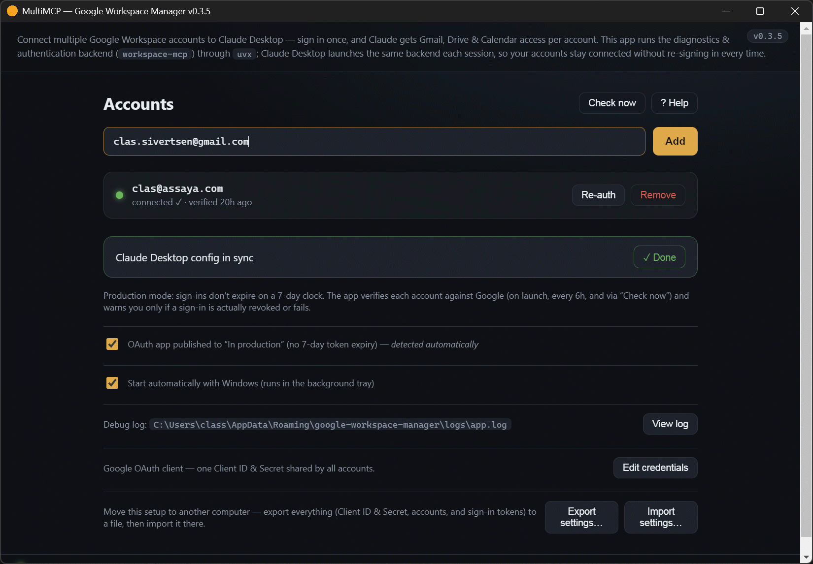
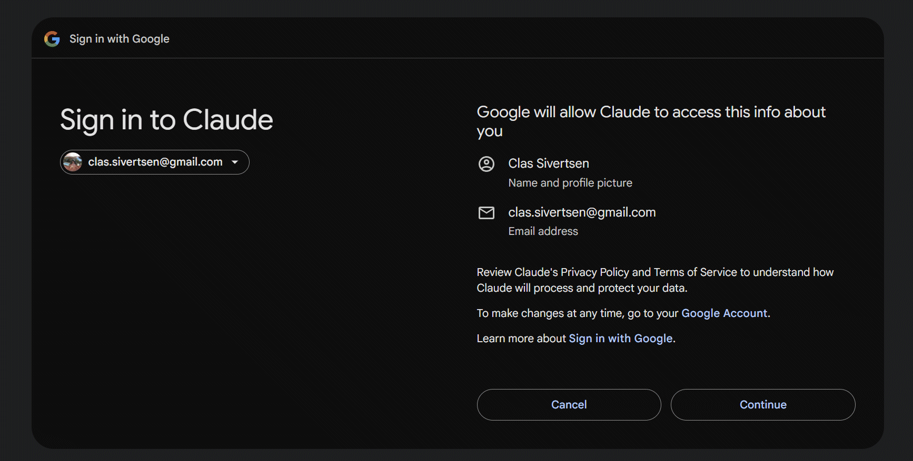
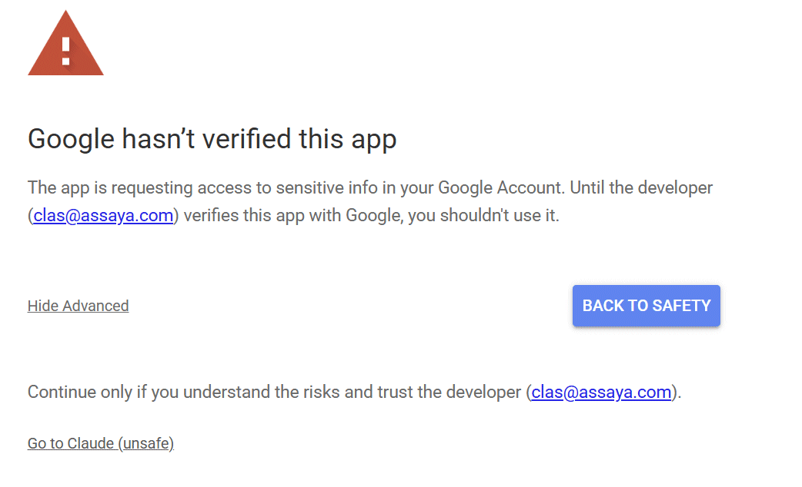
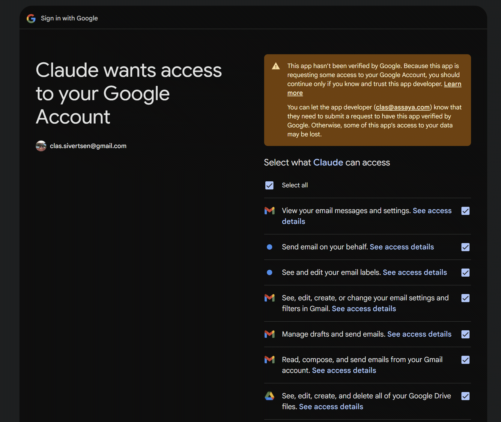
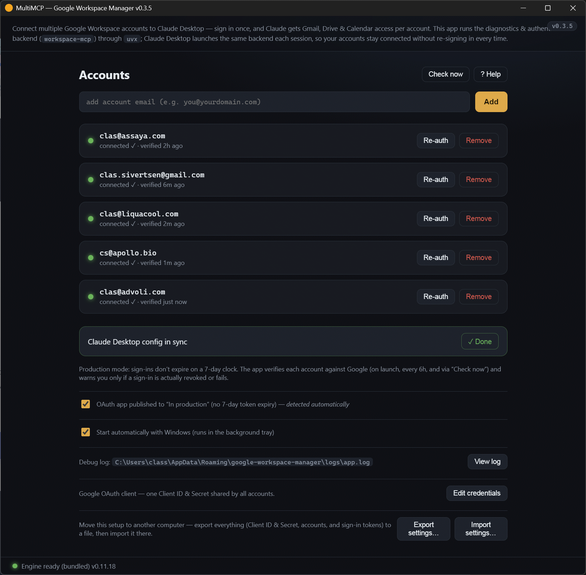
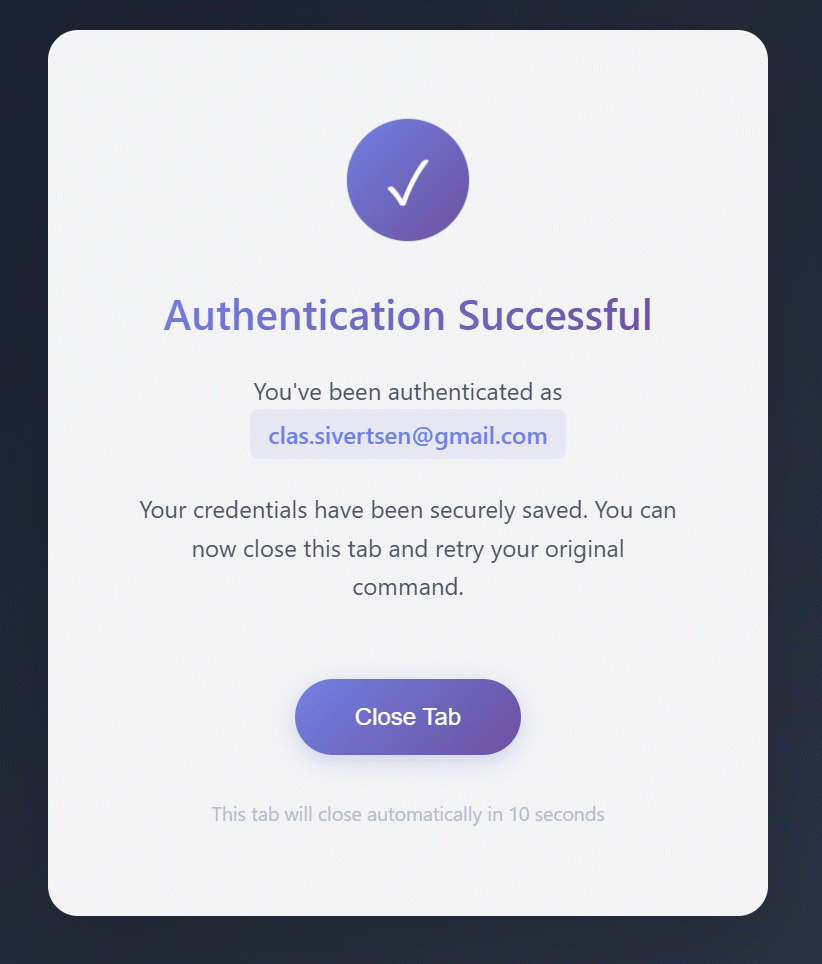

# Adding a Google account to Google Workspace Manager

A step-by-step guide to connecting a Google **Workspace** (or personal Gmail) account
so Claude Desktop can use its Gmail, Drive, and Calendar.

> 🖼️ The core sign-in flow (steps B3, B5–B9) is illustrated below. A few optional shots
> (B4, the Part C "publish to production" screens, and the Part A one-time setup) are
> still pending — see the shot-list at the end.

---

## The one thing to understand first

This app uses **one OAuth client, shared by every account.** That means:

- **The first time only,** you create one Google OAuth client (Part A below). You did
  this once already — you do **not** repeat it per account.
- **For each account after that,** you just **Add** the email in the app and **Sign in**
  once in your browser (Part B). That's the quick part.

There are two "modes" your OAuth app can be in, and they change Part B slightly:

| Mode | 7-day re-auth? | Need to pre-list each account? |
|---|---|---|
| **Testing** | Yes, tokens expire ~weekly | Yes — add every email as a **Test user** |
| **In production** *(recommended)* | No | No — any account can sign in |

If you've published your app to **In production** (see
[Part C — Get out of Testing mode](#get-out-of-testing)), you can **skip step B1**.

---

## Part A — One-time: create the Google OAuth client

> **Already added at least one account?** You already have this. **Skip to Part B.**

Do this once in the [Google Cloud Console](https://console.cloud.google.com/).

### A1. Create (or pick) a project
Create a project — e.g. *Claude Connector* — or select your existing one.

> 🖼️ **Screenshot — `images/add-account/a1-cloud-project.png`**
> _Capture:_ the Cloud Console project selector showing your project name.

### A2. Enable the three APIs
Under **APIs & Services → Library**, enable the **standard** APIs (not the
`*mcp.googleapis.com` previews):
- **Gmail API**
- **Google Drive API**
- **Google Calendar API** (`calendar-json.googleapis.com`)

> 🖼️ **Screenshot — `images/add-account/a2-enabled-apis.png`**
> _Capture:_ **APIs & Services → Enabled APIs & services** listing Gmail, Drive, Calendar.

### A3. Configure the OAuth consent screen
**APIs & Services → OAuth consent screen** (newer console: **Google Auth Platform →
Branding / Audience**). Set **User type / Audience = External**, an app name, and a
support email. You don't have to pre-add scopes — the app requests Gmail/Drive/Calendar
permissions at sign-in.

> 🖼️ **Screenshot — `images/add-account/a3-consent-screen.png`**
> _Capture:_ the consent-screen summary showing **Audience = External** and the app name.

### A4. Publish to production (recommended)
Leaving the app in **Testing** means every account's sign-in expires about weekly.
Publishing to **In production** removes that — it's free and instant. You can do it now
or later; the full steps (and the one-time re-auth it needs) are in
**[Part C — Get out of Testing mode](#get-out-of-testing)**.

### A5. Create the OAuth client ID
**APIs & Services → Credentials → Create credentials → OAuth client ID.** Choose
**Application type = Web application**, then add this **exact** Authorized redirect URI:

```
http://localhost:8000/oauth2callback
```

> 🖼️ **Screenshot — `images/add-account/a5-create-oauth-client.png`**
> _Capture:_ the Web-application client showing the redirect URI `http://localhost:8000/oauth2callback`.

### A6. Copy the Client ID + Secret into the app
Copy the **Client ID** and **Client secret**, open the app's **Credentials** screen, paste
both, and save. (The secret is stored in Windows Credential Manager, never in plaintext.)

> ⚠️ **Before screenshotting: blank out / blur the Client secret** (and ideally the tail
> of the Client ID). Never publish the secret.

> 🖼️ **Screenshot — `images/add-account/a6-app-credentials-screen.png`**
> _Capture:_ the app's Credentials screen with the fields filled (secret redacted).

---

## Part B — Add a Workspace account (do this for each account)

### B1. *(Testing mode only)* Add the email as a Test user
**Skip this if your app is "In production."** If it's still in **Testing**, go to the
consent screen's **Test users** and add the new address — otherwise Google blocks its
sign-in.

> 🖼️ **Screenshot — `images/add-account/b1-test-users.png`**
> _Capture:_ the **Test users** list with the new email added. *(Testing mode only.)*

### B2. *(Managed Workspace accounts only)* Allow the app in the Workspace admin console
If the new address belongs to a Google **Workspace** organization whose admin restricts
third-party apps, sign-in will be blocked until an admin trusts this app. In the
[Admin console](https://admin.google.com/) → **Security → Access and data control → API
controls → App access control → Configure new app → OAuth Client ID**, paste this app's
**Client ID** and mark it **Trusted**. (Personal `@gmail.com` accounts don't need this.)

> 🖼️ **Screenshot — `images/add-account/b2-admin-app-access.png`**
> _Capture:_ the Admin console App-access-control entry marking the Client ID Trusted.
> *(Only if your org restricts apps — optional.)*

### B3. Add the email in the app
In the app's **Accounts** screen, type the address in **add account email** and click
**Add**. A grey **not connected** card appears.



### B4. Click Sign in
On the new card, click **Sign in**. Your **system browser** opens to Google automatically.

> 🖼️ **Screenshot — `images/add-account/b4-app-card-signin.png`**
> _Capture:_ the grey account card showing the **Sign in** button.

### B5. Choose the account
In the browser, pick the address you're adding (it's pre-selected via a login hint).



### B6. Get past "Google hasn't verified this app"
For an unverified app you'll see a warning. Click **Advanced → Go to … (unsafe)**. This is
expected — it's your own app — and stays even in production unless you complete full Google
verification (not required for personal/team use).



### B7. Grant all permissions
Approve **all** requested Gmail / Drive / Calendar permissions. **Do not uncheck any** —
partial grants cause "missing scopes" errors later.



### B8. Confirm success
The browser shows **"Authentication successful."** You can close that tab.



### B9. Verify in the app
Back in the app the card turns **green**: **"connected ✓ · verified just now."** (If it
doesn't update immediately, click **Check now** at the top right.)



---

<a id="get-out-of-testing"></a>
## Part C — Get out of Testing mode (stop the weekly re-auth)

While your OAuth app is in **Testing**, Google expires every account's sign-in about once
a week. Switching to **In production** removes that — it's a free, instant Google Cloud
Console setting (no payment, no app review). Only the separate "unverified app"
click-through stays, which is harmless for your own app.

### C1. Open Publishing status
In the [Google Cloud Console](https://console.cloud.google.com/) with your project
selected, go to **APIs & Services → OAuth consent screen** (newer console: **Google Auth
Platform → Audience**). You'll see **Publishing status: Testing**.

> 🖼️ **Screenshot — `images/add-account/c1-publishing-status-testing.png`**
> _Capture:_ **Publishing status = Testing**, with the **Publish app** button visible.

### C2. Publish to production
Click **Publish app**, then confirm **Push to production**. The status changes to **In
production** — the 7-day clock is now off for any *new* sign-in.

> 🖼️ **Screenshot — `images/add-account/c2-publishing-status-production.png`**
> _Capture:_ **Publishing status = In production**.

### C3. Re-auth each existing account once  ⚠️ important
Publishing does **not** retroactively fix tokens that were already issued — a sign-in
done while in Testing keeps its 7-day expiry. So for **each** account already in the app,
click **Re-auth** once (it repeats the browser flow from steps B5–B8). The token minted
*after* publishing is the long-lived one.

> Accounts you add *after* publishing are long-lived from their first sign-in — only the
> ones signed in during Testing need this one-time re-auth.

### C4. Tell the app you're in production
On the app's dashboard, tick **"OAuth app published to 'In production' (no 7-day token
expiry)."** This removes the countdown and switches every card to the live
**"connected ✓ · verified …"** status. (If you skip it, the app **auto-detects**
production once a token survives past 7 days and ticks the box for you.)

> 🖼️ **Screenshot — `images/add-account/c3-app-production-checkbox.png`**
> _Capture:_ the dashboard with **"OAuth app published to 'In production'"** ticked.

### C5. Confirm it worked
Click **Check now** — the card should read **"connected ✓ · verified just now"** with no
countdown.

> **How can I be *sure* the 7-day clock is off?** A live check proves the token works
> *right now* but can't reveal its lifetime (Google doesn't expose it). The only certain
> confirmations are: you **re-authed after** publishing (C3), or you watch a token keep
> working past 7 days (the app's auto-detect). Both end in the same place — no more weekly
> re-auth.

---

## Use the new account in Claude

You do **not** need to click **Write config** again — the shared `google_workspace` server
already reads every account in the credentials folder. Just **start a new Claude Desktop
chat** (or fully quit and reopen Claude to be safe). Then name the account in your request:

> *"Using google_workspace, search Gmail in `new.address@yourdomain.com` for invoices from
> last month."*

---

## Troubleshooting

| Symptom | Fix |
|---|---|
| `redirect_uri_mismatch` in the browser | The OAuth client is missing the redirect URI `http://localhost:8000/oauth2callback` (Part A5). Newly added URIs can take a few minutes to apply. |
| `access_denied` / "App not verified" blocks you | In **Testing**, add the email as a **Test user** (B1). Then click **Advanced → Go to … (unsafe)** (B6). |
| "Access blocked: app's request is invalid" / admin policy | The account's **Workspace admin** restricts apps — trust the Client ID in the Admin console (B2). |
| **"Port 8000 is in use"** at Sign in | Another process holds the sign-in port. Fully **quit + reopen Claude Desktop** (its server uses port 9000, leaving 8000 free), then retry. |
| Card won't turn green | Finish consent fully (grant **all** scopes), then click **Check now**, or **Re-auth** the card. |
| **"Could not attach to MCP server google_workspace"** in Claude | A cold-start timeout while `uvx` installs a new `workspace-mcp` version. Keep the tray app running (it pre-warms the cache on launch + every 6h); if it happens, **reopen Claude once more** — the next attach is fast. |

More detail and where files live: see **[HELP.md](HELP.md)**.

---

## Screenshot shot-list (for contributors)

Save images under `docs/images/add-account/`. **Parts B and C are the important sets**
(adding an account, and publishing to production); **Part A is optional** (only if updating
the one-time-setup visuals). **Redact the Client Secret in any Console screenshots.**

| # | File | What it shows | Needed |
|---|---|---|---|
| A1 | `a1-cloud-project.png` | Cloud project selector | optional |
| A2 | `a2-enabled-apis.png` | Gmail/Drive/Calendar enabled | optional |
| A3 | `a3-consent-screen.png` | Consent screen = External | optional |
| A5 | `a5-create-oauth-client.png` | Web client + redirect URI | optional |
| A6 | `a6-app-credentials-screen.png` | App Credentials screen (secret redacted) | optional |
| B1 | `b1-test-users.png` | Test users list | Testing mode only |
| B2 | `b2-admin-app-access.png` | Admin console: Client ID trusted | managed-org only |
| B3 | `b3-add-email.gif` | App: email typed + Add | ✅ added |
| B4 | `b4-app-card-signin.png` | App: grey card + Sign in | pending |
| B5 | `b5-account-consent.gif` | Choosing the account | ✅ added |
| B6 | `b6-unverified-advanced.gif` | "Hasn't verified" → Advanced | ✅ added |
| B7 | `b7-grant-scopes.gif` | Consent / grant scopes | ✅ added |
| B8 | `b8-auth-success.gif` | "Authentication successful" | ✅ added |
| B9 | `b9-app-connected.gif` | App: accounts connected | ✅ added |
| C1 | `c1-publishing-status-testing.png` | Console: Publishing status = Testing (+ Publish app) | **yes** |
| C2 | `c2-publishing-status-production.png` | Console: Publishing status = In production | **yes** |
| C3 | `c3-app-production-checkbox.png` | App: production checkbox ticked | **yes** |
